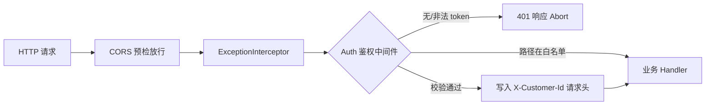

## 用户需求
- 补充前端请求权限校验能力，对请求 header 中传递的 token 进行校验。
- 前端通过 `Authorization: Bearer <token>` 传递 token（Authorization 已在 CORS 白名单中）。
- 从 token 中解析出 customerid，并写入请求 header `X-Customer-Id`，供后续业务读取使用。
- 鉴权中间件需支持白名单配置，当前登录接口 `/api/v1/customers/login` 默认放行。

## 产品概述
为现有基于 Gin 的 API 服务增加统一的鉴权中间件，复用项目自身签发的 JWT（HS256）完成验签与过期校验，并将 customer 标识透传到下游业务处理链，未携带或非法 token 的请求返回 401。

## 核心功能
- 解析并校验 `Authorization: Bearer <token>` 中的 JWT（验签 + 过期时间校验）。
- 白名单路径放行（可配置，登录接口默认免鉴权）。
- 校验通过后将 customerid（token 中的 `uid` claim）写入请求头 `X-Customer-Id`。
- 校验失败统一返回 401 未授权响应。


## 技术栈
- 语言/框架：Go + Gin（沿用现有项目栈）。
- 复用：现有 `internal/jwt`（HS256 生成）、`config.JWTSecret` / `JWTExpireSeconds`、`internal/common/response` 与 `internal/common/bizerror` 统一响应体系。

## 实现方案
### 总体策略
在现有 `internal/jwt` 包补充 Parse 解析与校验函数，新增 `internal/middleware/auth.go` 鉴权中间件，依赖 config 中的白名单配置；校验通过后将 customerid（token `uid` claim）以字符串形式写入请求头 `X-Customer-Id`，并可选同步到 gin context 方便 handler 取用。

### 关键技术决策
1. **复用项目自有 JWT**：前端持有的 token 即登录接口签发的 JWT，使用同一 `JWTSecret` 验签，不引入第三方 JWT 库，与现有 `jwt.Generate` 保持编解码一致（`base64.RawURLEncoding`、HS256）。
2. **customerid 来源**：JWT payload 的 `uid` claim（登录时写入 `cust.ID`），即 customer 的唯一标识，以字符串写入 `X-Customer-Id`。
3. **白名单可配置**：`config.Config` 增加 `AuthWhitelist []string`，从环境变量 `AUTH_WHITELIST`（逗号分隔）读取，默认包含 `/api/v1/customers/login`；中间件对请求路径做精确匹配放行，便于后续扩展公开接口。
4. **401 业务码**：在 `bizerror` 新增 `CodeUnauthorized`（如 40100，文案"未登录或登录已过期"），通过 `response.Fail(c, http.StatusUnauthorized, ...)` 输出统一结构。

### 性能与可靠性
- `jwt.Parse` 为纯字符串拆分 + HMAC 计算 + 过期比较，时间复杂度 O(1)，无任何 DB/IO，开销极低，适合作为全局中间件。
- CORS 中间件已先行 `AbortWithStatus` 处理 OPTIONS 预检，预检请求不会进入鉴权链。
- 校验失败仅返回 401 与泛化文案，不泄露 JWT 解析底层错误细节（防信息泄露）。

### 实现注意事项
- 中间件在 `c.Request.Header.Set("X-Customer-Id", value)` 后调用 `c.Next()`，确保后续 handler 从 request header 读取。
- 返回 401 时调用 `c.Abort()`，确保不再进入后续处理链；使用 `response.Fail` 写出（其内部不 panic，无需 ExceptionInterceptor 介入）。
- 保持生成/解析对 header、payload 的编解码方式完全一致；若签名不匹配或 `exp` 过期或格式非法，统一视为 401。
- 向后兼容：白名单默认含登录接口，其他业务接口（order/product/menu/area/store 等）自动纳入校验，不改变现有路由注册方式（`Registerable` 模式不变）。

## 架构设计
在 `router.Setup` 现有全局中间件链（Logger → CORS → ExceptionInterceptor）中插入 Auth 中间件（置于 CORS 之后、业务 handler 之前）。白名单外的请求执行 token 校验，通过后注入 `X-Customer-Id` 头再放行。



## 目录结构
```
internal/
├── jwt/
│   └── jwt.go              # [MODIFY] 新增 Parse(secret, token) (*Claims, error)：拆分 JWT、HMAC 验签、校验 exp、返回 Claims；新增解析相关 error 变量。
├── common/
│   └── bizerror/
│       └── bizerror.go     # [MODIFY] 新增 CodeUnauthorized = BizErrorCode{Code: 40100, Message: "未登录或登录已过期"}。
├── config/
│   └── config.go           # [MODIFY] 新增 AuthWhitelist []string 字段；Load() 中从 AUTH_WHITELIST 读取并以登录路径为默认；可选提供合并默认值的方法。
├── middleware/
│   ├── auth.go             # [NEW] Auth(cfg, whitelist) gin.HandlerFunc：读取 Bearer token、调用 jwt.Parse、白名单匹配、写入 X-Customer-Id、校验失败返回 401。
│   └── auth_test.go        # [NEW] 覆盖白名单放行、缺 token、非法 token、过期 token、正常注入 X-Customer-Id 等场景（使用 httptest）。
├── router/
│   └── router.go           # [MODIFY] 在 r.Use(...) 全局链中挂载 middleware.Auth(cfg, cfg.AuthWhitelist)。
└── jwt/
    └── jwt_test.go         # [NEW] 验证 Generate 产出可被 Parse 正确解析（含验签与 exp 校验），以及篡改签名被拒。
```

## 关键代码结构
```go
// internal/jwt/jwt.go
// Parse 使用 HMAC-SHA256 校验 token 签名并校验过期时间，返回载荷中的 Claims。
func Parse(secret string, token string) (*Claims, error)

// internal/middleware/auth.go
// Auth 返回 gin 鉴权中间件：白名单路径直接放行；否则解析 Bearer token，
// 校验通过后将 Claims.UID 以字符串写入请求头 X-Customer-Id 并放行，失败返回 401。
func Auth(whitelist []string) gin.HandlerFunc
```

